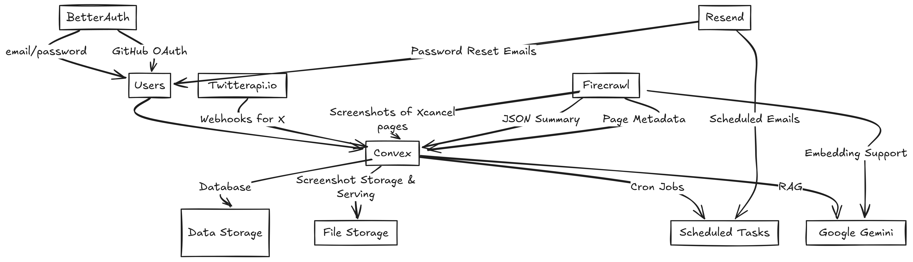

# Bookmarker

Bookmarker is a tool that makes bookmarking tweets on X practical, searchable, and fully under user control. Instead of relying on X’s limited bookmarking and search features, users can tag a dedicated account `@usepanda_` on any tweet with command `bookmark this`. That mention triggers a webhook through Twitterapi.io, which then stores and embedds the tweet inside Bookmarker.

The goal is to give users ownership over their saved content and provide accountability for deleted or edited tweets, especially from public figures.

---

## Why Bookmarker

- **Reliable search**: Easily search through bookmarked tweets without depending on X’s unreliable search.
- **Ownership**: Keep your archive as long as you want, delete it when you want.
- **Accountability**: Preserve tweets that may later be deleted, making it easier to hold public figures accountable.
- **Simplicity**: Tagging the `@usepanda_` account with command `bookmark this` is all it takes to bookmark a tweet.

---a

## How It Works

1. User tags a special “bookmark” account in a tweet.
2. Twitterapi.io webhook delivers the event to Bookmarker.
3. Convex receives the payload and processes it.
4. Firecrawl generates a screenshot, summary, and metadata.
5. Tweets and metadata are stored in Convex for search and retrieval.
6. Retrieval-augmented generation (RAG) with Google Gemini enables smarter discovery.
7. BetterAuth provides authentication (email/password and GitHub OAuth).
8. Resend manages password reset and scheduled emails.

---

### Workflow Diagram



---

## Tech Stack

- **Convex**: Database, storage, cron jobs, and RAG integration with Gemini.
- **BetterAuth**: Authentication (email/password, GitHub OAuth).
- **Twitterapi.io**: Unofficial webhook provider for X mentions.
- **Firecrawl**: Screenshots, summaries, and metadata enrichment.
- **Resend**: Password reset and scheduled emails.

---

## Features

- Bookmark tweets by simply tagging an account in your reply.
- View, search, and manage bookmarked tweets.
- Store screenshots and summaries for context.
- Detect and retain tweets that may later be deleted from X.

---

## Setup

### Prerequisites

- Convex project setup
- API keys for Twitterapi.io, Firecrawl, Resend
- Node.js environment

### Installation

```bash
git clone https://github.com/emee-dev/accountable.git
cd accountable
pnpm install
```

Set environment variables in `.env`:

```
# https://twitterapi.io/
TWITTER_API_IO_SECRET=""

FIRECRAWL_API_KEY=""

# Deployment used by `npx convex dev`
CONVEX_DEPLOYMENT="" # team: infinite-loop, project: accountable-d6f6c

NEXT_PUBLIC_CONVEX_URL=""

NEXT_PUBLIC_CONVEX_SITE_URL=""
SITE_URL=http://localhost:3000

# Github Oauth
GITHUB_CLIENT_ID=""
GITHUB_CLIENT_SECRET=""

# Email
RESEND_API_KEY=""
RESEND_WEBHOOK_SECRET=""
NEXT_PUBLIC_SITE_URL=""


# Google gemini
GEMINI_API_KEY=""
```

### Development

```bash
pnpm dev
```

---

## Demo

1. Tag `@usepanda_` account on X in your replies.

```ts
@usepanda_ bookmark this
```

2. It takes around 1-2 minutes to reflect on the dashboard.
3. Webhook triggers processing
4. Open the Bookmarker dashboard to search, view bookmarks.

Include:

- Link to live demo [Vercel](https://accountable-lemon.vercel.app/).
- Short demo video (walkthrough of bookmarking and search).

---

## Future Enhancements

- Ability to delete tweet on Bookmarker.
- Deleted tweet detection and alerts.
- Public bookmark collections.
- AI-based categorization and clustering.
